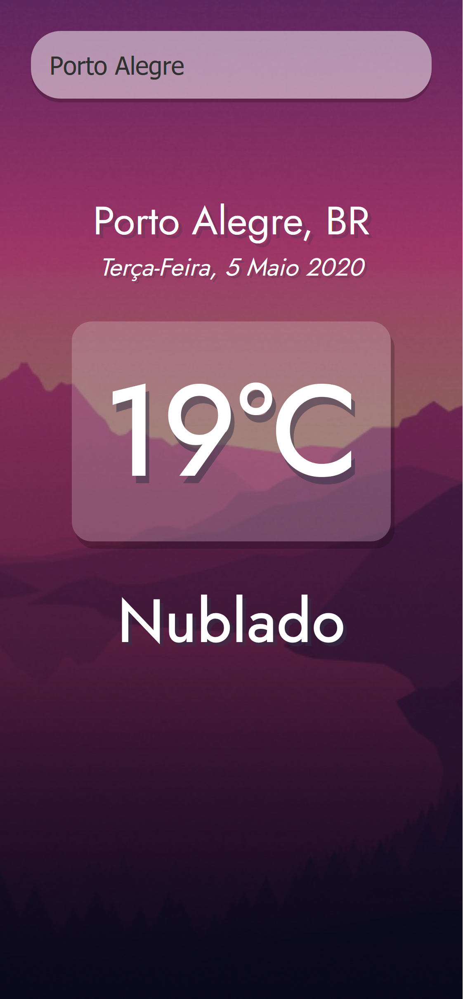

 </a>

<h3 align="center">weather-app</h3>

---

 
  Esse é um projeto simples de clima atual que consome uma API pública de temperatura.
      

## 📝 Conteúdo

- [Sobre](#about)
- [Getting Started](#getting_started)
- [Usage](#usage)
- [Built Using](#built_using)

## 🧐 Sobre 

O objetivo desse projeto foi praticar o consumo de APIs e criação de web apps com React e a utilização dos hooks.

## 🏁 Getting Started 

### Prerequisites

Só é necessário ter o NodeJS instalado e uma conexão com a internet :)

### Installing

Rode 'npm install' e em seguida 'npm start' na pasta raiz.

## 🎈 Usage 

Digite o nome da cidade que quer consultar na barra de pesquisa.

## ⛏️ Built Using 

- [NodeJs](https://nodejs.org/en/) - Ambiente de Server
- [openweather](https://openweathermap.org/) - API utilizada 
